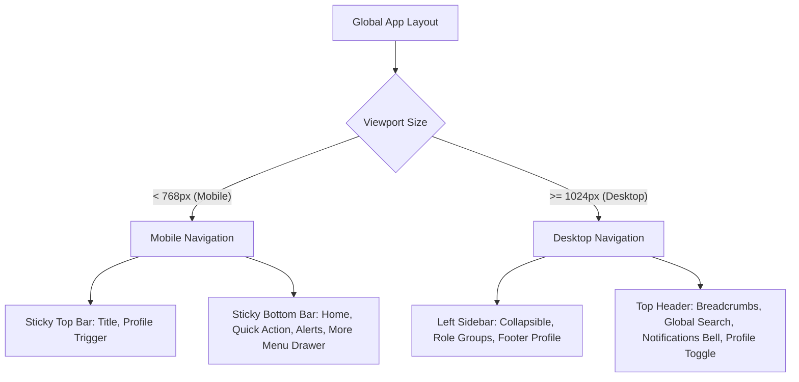
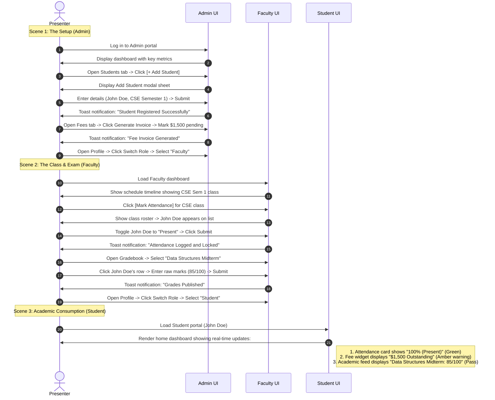

# College ERP System: UI/UX Blueprint (MVP)

This document establishes the comprehensive UI/UX design architecture, layout structures, page hierarchies, and interactive flows for the MVP College ERP. The design system is optimized for a **mobile-first** responsive environment targeting three key roles: **Admin**, **Faculty**, and **Student**, utilizing Next.js, TailwindCSS, and shadcn/ui design tokens.

---

## SECTION 1: Overall Design Philosophy

To deliver a premium, SaaS-like operational experience for educational institutions, the UI is driven by five core tenets:

1. **Simple:** Cognitive load is minimized by flattening page hierarchies and grouping related tasks. Workflows that traditionally span multiple administrative screens (like user onboarding and fee collection) are consolidated into cohesive, modal-driven experiences or single-page wizards.
2. **Modern:** The interface features a sleek default dark-mode preference using depth-enhancing container gradients, frosted-glass filters (`backdrop-blur-md`), thin borders for separation, and subtle box shadows. Surfaces mimic physical layers with HSL-controlled dark neutrals.
3. **Fast:** Interaction patterns are optimized for sub-100ms visual feedback. Rather than blocking the user during transitions, the UI leverages optimistic updates, localized skeleton loaders, and instant slide-over sheets.
4. **Accessible:** The interface strictly complies with WCAG 2.1 AA standards. Minimum text contrast is set at 4.5:1. Accessible interactive components leverage shadcn/ui's Radix UI primitives, featuring full keyboard navigation, explicit focus rings, and proper ARIA role mapping.
5. **Professional:** The visual style projects authority and trust. Indigo is the primary brand identifier, representing academic focus, paired with slate-colored surfaces to keep data presentation clear and readable.

### Visual Identity System
*   **Brand Color:** Indigo (`#6366f1` / HSL `239 84% 67%`) used selectively for active nav icons, primary actions, and success highlights to avoid visual fatigue.
*   **Typography:** **Outfit** (Google Fonts) for display typography, headers, metrics, and page headings to project a modern, premium look. **Inter** for data grids, body text, form elements, and status badges to maintain high readability.
*   **Elevations & Depth:** The UI uses three visual depths:
    *   *Base Layer:* Neutral background (`#0a0a0a` in dark, `#f8fafc` in light).
    *   *Surface Layer:* Card containers, sidebars, and headers (`#171717` in dark, `#ffffff` in light) with a 1px border (`#262626` in dark, `#e2e8f0` in light).
    *   *Interactive Layer:* Modals, dropdown flyouts, and active tab states (`#262626` in dark, `#f1f5f9` in light).

---

## SECTION 2: Navigation System

The navigation dynamically scales between primary mobile devices and secondary desktop viewports, using a single unified React routing model with responsive layout boundaries.

### Mobile Navigation (Primary)
On screen sizes below 640px, navigation is optimized for thumb-reach and single-handed operations.
*   **Bottom Navigation Bar:** A sticky, bottom bar (`h-16`, background blur, semi-transparent border-t) housing 4 primary destinations:
    *   *Dashboard:* Home icon, redirects to the role-specific landing screen.
    *   *Action Hub:* A center-aligned action icon (dynamically changing per role: "Users" for Admin, "Attendance" for Faculty, "Schedule" for Student) wrapped in an Indigo gradient container.
    *   *Inbox/Notifications:* Bell icon with a red dot notification indicator.
    *   *Menu (Drawer):* Avatar/Burger menu icon that opens a slide-up bottom sheet containing secondary settings, role switching, and logout controls.
*   **Top App Bar:** A minimal sticky header (`h-14`) featuring:
    *   Left side: Current page context or dynamic breadcrumb.
    *   Right side: Quick role switcher dropdown and user profile indicator.

### Desktop Navigation (Secondary)
On screen sizes above 1024px, the layout shifts to a structured multi-column panel.
*   **Persistent Sidebar:** A collapsible left sidebar (`w-64` expanded, `w-20` collapsed) utilizing a smooth width transition.
    *   *Header:* Institution logo and role banner indicator ("Administrator", "Faculty Module", "Student Portal").
    *   *Navigation Groupings:* Grouped links under headers (e.g., "Academic Management", "Financial Services", "System Configuration").
    *   *Footer:* Collapsed toggle icon, user profile summary, and a quick-logout button.
*   **Desktop Top Navbar:** A horizontal navigation bar (`h-16`) containing a global search bar (Cmd/Ctrl + K), notification popover trigger, and profile menu flyout.



### Role Switching & Profiles
*   **Role Switcher:** For demo and administrative testing purposes, a fast role switcher dropdown is accessible in the top header. Clicking a role initiates a smooth fade transition, clearing the UI cache and loading the selected role's homepage.
*   **Profile Menu Dropdown:** Clicking the user profile avatar opens a clean, border-aligned popover:
    *   User name, system ID, and active role tag.
    *   Link to Profile Settings.
    *   Interactive Theme Toggle (Light / Dark / System mode).
    *   Red-accented "Log Out" action with verification modal.
*   **Notification Popover:** A tabbed notification drawer:
    *   *All:* Chronological feed of academic and fee alerts.
    *   *Urgent:* Filtered view showing unpaid dues or pending exam entry windows.
    *   Actionable card components: tapping an attendance alert redirects the user directly to the corresponding attendance session sheet.

---

## SECTION 3: Admin Experience

The Admin layout emphasizes system-wide control, reporting, and quick object creation.

```
+-----------------------------------------------------------------------+
|  [Logo]  ERP Admin Dashboard                     (Search...)  [ Bell ] [Avatar] |
+-----------------------------------------------------------------------+
|  +-------------------+  +-------------------+  +-------------------+  |
|  | Active Students   |  | Average Attendance|  | Fee Collection    |  |
|  | 5,124  [+4.2%]    |  | 82.4%  [-1.2%]    |  | $124,500   [92%]  |  |
|  +-------------------+  +-------------------+  +-------------------+  |
|                                                                       |
|  +-------------------------------------+  +-------------------------+ |
|  | Quick Actions                       |  | Recent Activities       | |
|  | [ + Add Student ]  [ + Add Faculty] |  | > New Student: J. Doe   | |
|  | [ Generate Fee ]   [ View Report ]  |  | > Fee Marked Paid: R. S.| |
|  +-------------------------------------+  +-------------------------+ |
+-----------------------------------------------------------------------+
```

### Dashboard Layout
*   **Analytical Banner:** 4 high-level KPI cards displaying Total Active Students, Active Faculty, Cumulative System Attendance, and Fee Collection progress (Realized vs. Target).
*   **Quick Actions Panel:** A prominent grid of primary action cards. Clicking actions like "Onboard Student" or "Generate Invoice" triggers a focused overlay dialog rather than loading a new page, maintaining the user's dashboard context.
*   **Activity Log:** A live, read-only feed of system logs (e.g., "Faculty registered 'Math I' grades", "Student profile generated").

### Management Views
*   **Student Directory:** A dense, filterable list table:
    *   Columns: Avatar/Name, Roll Number, Program/Semester, Active Status Badge, Actions button.
    *   Header controls: Multi-select batch actions (e.g., Batch Invoice Generation), global filter text box, and "Export CSV".
    *   Clicking a row slides out a right-side drawer displaying the student's complete record, outstanding invoices, and cumulative attendance.
*   **Faculty Allocation:** A grid of department-sorted cards showing faculty workload:
    *   Lists assigned classes, active timetables, and grading compliance status.
    *   Includes a slide-over modal for mapping faculty members to new subjects or adjusting active schedules.
*   **Course Configurator:** A nested accordion hierarchy showing Departments -> Programs -> Semesters -> Electives. It features inline creation actions for fast curriculum setup.
*   **Fee Ledger:** A dashboard displaying overall collection statistics:
    *   Filterable collection logs (Paid, Pending, Delinquent).
    *   Interactive Invoice Table with a quick "Mark as Paid" action button that pops open a transaction details validation modal.

---

## SECTION 4: Faculty Experience

The Faculty UI focuses strictly on classroom execution, task completion, and grading speed.

```
+-----------------------------------------------------------------------+
|  [Logo]  Faculty Dashboard                      (Today's date) [ Bell ] [Avatar] |
+-----------------------------------------------------------------------+
|  +-------------------------------------+  +-------------------------+ |
|  | Today's Classes                     |  | Pending Tasks           | |
|  | [09:00 AM] Data Structures (CS-A)   |  | [!] Enter Midterm Marks | |
|  |   [ Mark Attendance ]               |  |     Data Structures     | |
|  |                                     |  | [ ] Confirm Attendance  | |
|  | [11:30 AM] Algorithms (CS-B)        |  |     Discrete Math (Mon) | |
|  +-------------------------------------+  +-------------------------+ |
+-----------------------------------------------------------------------+
```

### Dashboard Layout
*   **Today's Schedule Timetable:** A timeline layout showcasing assigned sessions for the day, marked by time blocks, subject names, and classrooms.
    *   *Upcoming Class:* Highlighted with an indigo card border.
    *   *Active/Current Class:* Features an animated pulsing red beacon and a primary action button labeled "Mark Attendance".
    *   *Completed Class:* Grayed out with a green checkmark indicating "Attendance Saved".
*   **Grading Compliance Widget:** A warning card listing classes with pending grade submissions or upcoming gradebook lock deadlines.

### Classroom Actions
*   **Attendance Matrix:** A full-screen roster optimized for rapid touch input on tablets and mobile screens:
    *   Roster list with student profile photos and large, color-coded interactive status buttons: Present (Green check), Absent (Red X), Late (Amber clock).
    *   Header features a "Select All Present" bulk toggle.
    *   Quick indicators highlight students dropping below the 75% attendance threshold.
    *   A bottom submission banner shows a summary of counts (e.g., "52 Present, 3 Absent") with a primary "Submit & Lock" button.
*   **Gradebook Entry Grid:** A clean spreadsheet-inspired input ledger:
    *   Displays students vertically, with editable cells mapping to internal evaluations (Midterm, Lab, Final).
    *   Enforces inline visual validation: values out of range (e.g., >100) highlight the cell border in red and display a helper alert.
    *   "Save Draft" and "Publish Grades" action actions are pinned to a floating action bar at the bottom.

---

## SECTION 5: Student Experience

The Student dashboard is designed as a clear, visual portal focused on academic status, attendance safety margins, and outstanding obligations.

```
+-----------------------------------------------------------------------+
|  [Logo]  Student Portal                               [ Bell ] [Avatar] |
+-----------------------------------------------------------------------+
|  +-----------------------+  +---------------------------------------+ |
|  | Academic Standing     |  | Cumulative Attendance                 | |
|  | B.Tech CSE - Sem 4    |  | [====================] 84.5%          | |
|  | CGPA: 8.74  [Active]  |  | status: Safe (+3 classes margin)      | |
|  +-----------------------+  +---------------------------------------+ |
|                                                                       |
|  +-----------------------+  +---------------------------------------+ |
|  | Unpaid Invoices       |  | Recent Grades                         | |
|  | Tuition Fee: $1,500   |  | Data Structures (Mid): 85/100  [A]    | |
|  | [ Pay Invoice ]       |  | Operating Systems (Lab): 45/50 [A+]   | |
|  +-----------------------+  +---------------------------------------+ |
+-----------------------------------------------------------------------+
```

### Dashboard Layout
*   **Academic Identity Widget:** Display profile summary with student name, ID number, program name, active semester, and digital ID card toggle.
*   **Interactive Attendance Ring:** A card containing a circular progress bar reflecting current semester attendance:
    *   `>= 75%`: Colored in Emerald, labeled "Safe".
    *   `70% - 74%`: Colored in Amber, labeled "Warning: You must attend the next 3 lectures to reach 75%".
    *   `< 70%`: Colored in Red, labeled "Detention Risk: Blocked from exams".
*   **Unpaid Fees Banner:** A card highlighting outstanding fee obligations. If a balance is due, it displays a yellow warning icon, the amount due, the due date, and an action button to "View Ledger".
*   **Gradebook Overview:** A minimal feed of the latest published scores with letter grade conversions and links to the full academic transcript.

### Details Views
*   **Attendance Detail Log:** A tabular breakdown listing subjects, lectures attended, total lectures held, and historical attendance logs (including date/time checks and marked status).
*   **Financial Ledger:** An invoice-driven transaction list:
    *   Features a clear split between current outstanding invoices (top) and paid payment history (bottom).
    *   Tapping an invoice row slides up an invoice detail modal containing items, scholarship adjustments, and receipt generation keys.
*   **Exam Grade Sheet:** A cumulative academic ledger grouping grades by semester, calculated SGPA/CGPA, credits earned, and backlog flags.

---

## SECTION 6: Page Hierarchy

The MVP routing is structured logically by user role pathways.

```
/ (Global Landing Page with Unified Role Login Switcher)
│
├── /admin
│   ├── /dashboard (analytical cards, quick action overlay controls)
│   ├── /students (data grid table, details drawer, import/add student views)
│   ├── /faculty (workload cards, allocation dialog, add faculty views)
│   ├── /courses (curriculum hierarchy list, subject configs)
│   └── /fees (financial reports, outstanding invoice list, validation actions)
│
├── /faculty
│   ├── /dashboard (schedule timeline, pending grading checklists)
│   ├── /attendance (student list roster, present/absent touch controls)
│   ├── /grades (gradebook sheet, inline inputs, publication dialogs)
│   └── /subjects (assigned subject overview, cumulative performance statistics)
│
└── /student
    ├── /dashboard (circular progress gauges, fee warning cards, grade feed)
    ├── /attendance (subject-wise ledger list, absence justifications)
    ├── /grades (transcript records, semester grade cards)
    └── /fees (invoice ledger list, payment detail modal views)
```

---

## SECTION 7: Shared Components

To ensure high performance and visual styling consistency, the UI utilizes reusable design components built on top of Tailwind utility classes and shadcn/ui layouts.

*   **Metric Cards:** Contain a top label, a primary metric typography block (`text-2xl font-bold font-sans`), a bottom trend metric (`text-xs flex items-center`), and an optional right-aligned icon.
*   **Responsive Data Tables:**
    *   *Desktop:* Standard table layout with fixed header column widths, sorting toggles, hover rows, and interactive rows.
    *   *Mobile:* Table columns auto-collapse, rendering as card lists where rows fold vertically. Mobile layout preserves key indicators (e.g., student name and state badge) while primary actions remain accessible.
*   **Forms & Inputs:** Standard inputs featuring thin borders, floating labels, explicit field focus outlines, error borders (`border-red-500`), and inline description boxes.
*   **Status Badges:** Compact visual pills (`px-2.5 py-0.5 text-xs font-semibold rounded-full`) utilizing a responsive color-state model:
    *   *Success/Paid/Active:* `bg-emerald-500/10 text-emerald-500 border border-emerald-500/20`
    *   *Pending/Installment/Warning:* `bg-amber-500/10 text-amber-500 border border-amber-500/20`
    *   *Danger/Failed/Overdue/Detained:* `bg-rose-500/10 text-rose-500 border border-rose-500/20`
    *   *Inactive/Archived/Muted:* `bg-slate-500/10 text-slate-400 border border-slate-500/20`
*   **Skeleton Loaders:** Component matching templates showing animated gradient pulses (`animate-pulse bg-neutral-800`), applied during initial data queries to prevent page layout shifts.
*   **Empty State Blocks:** Clean visual displays centered on the screen, presenting a simple icon, a descriptive label, a support instruction, and a single primary CTA button.

---

## SECTION 8: Mobile-First Strategy

The ERP MVP's layout scales responsively from small touchscreens up to wide monitors.

| Screen Width | Target Device Class | Primary Layout Changes & Design Choices |
| :--- | :--- | :--- |
| **< 640px** | Mobile Phones | Sidebar hidden. Bottom sticky nav enabled. Grid layouts collapsed to single columns. Full-screen drawer sheets slide up from bottom for form inputs. Touch-friendly targets mapped to a minimum `48x48px` bounding box. |
| **640px - 1024px**| Tablets & Small Laptops| Left sidebar displayed in compact state (icons only). Bottom nav disabled. Two-column grid layouts for dashboard metrics. Dialog boxes used for quick workflows. |
| **> 1024px** | Desktops & Monitors | Left sidebar fully expanded showing logo and titles. Multi-column dashboard layouts. Global search shortcut (Cmd/Ctrl + K) active. Action dialogs open as centered overlays with drop-shadow layers. Hover states enabled on clickable elements. |

---

## SECTION 9: Dashboard Widgets

The dashboard modules serve targeted operational actions for each user type.

### 1. Admin Widgets
*   **KPI Metrics Carousel:** High-level metrics tracking total students, active sections, overall college attendance, and outstanding accounts.
*   **Fee Breakdown Donut:** Circular chart illustrating collected fees vs. pending fees.
*   **Recent Audits Feed:** Bullet list tracking user creations, course mappings, and billing edits.

### 2. Faculty Widgets
*   **Active Timetable Slot:** Dynamic card focusing on the next immediate lecture slot, highlighting batch name, location, and a button to initiate attendance.
*   **Grading To-Do Checklist:** Task card displaying incomplete exam entry sheets with a countdown of remaining submission days.
*   **Broadcast Banner:** A modal trigger allowing the faculty member to write an announcement directly to their enrolled student groups.

### 3. Student Widgets
*   **Attendance Gauge:** Large circular dial illustrating cumulative attendance, with text color indicating grade eligibility status.
*   **Fee Alert Banner:** Yellow alert layout showing overdue balances, due dates, and a direct button to pay or print receipts.
*   **Term Transcript Card:** Card displaying latest academic results, listing GPA, credit units, and backlog status.

---

## SECTION 10: Design System Tokens

The visual layout translates directly into Tailwind configuration parameters:

```json
{
  "theme": {
    "fontFamily": {
      "sans": ["Inter", "sans-serif"],
      "display": ["Outfit", "sans-serif"]
    },
    "colors": {
      "background": {
        "light": "#f8fafc",
        "dark": "#0a0a0a"
      },
      "surface": {
        "light": "#ffffff",
        "dark": "#121212"
      },
      "border": {
        "light": "#e2e8f0",
        "dark": "#262626"
      },
      "primary": {
        "indigo-500": "#6366f1",
        "indigo-600": "#4f46e5"
      },
      "states": {
        "emerald": "#10b981",
        "amber": "#f59e0b",
        "rose": "#f43f5e",
        "slate": "#64748b"
      }
    },
    "borderRadius": {
      "lg": "12px",
      "md": "8px",
      "sm": "4px"
    },
    "boxShadow": {
      "soft": "0 4px 6px -1px rgb(0 0 0 / 0.1), 0 2px 4px -2px rgb(0 0 0 / 0.1)",
      "card": "0 10px 15px -3px rgb(0 0 0 / 0.05), 0 4px 6px -4px rgb(0 0 0 / 0.05)"
    }
  }
}
```

---

## SECTION 11: Demo Flow (The Golden Path)

This step-by-step interactive flow details how the user moves between roles to demonstrate the MVP's capabilities.



---

## SECTION 12: Self-Review & Refinements

A critical architectural review of the UI/UX design highlights the following optimizations:

1.  **Mobile Usability:**
    *   *Design Check:* Complex menus could cause issues on smaller screens.
    *   *Refinement:* All action paths on mobile screens are routed through slide-up bottom sheets (`shadcn/ui drawer/sheet`). Interactive elements are restricted to a minimum of 48px height to prevent accidental presses.
2.  **Navigation Complexity:**
    *   *Design Check:* Admin sidebars can look cluttered when collapsed.
    *   *Refinement:* The sidebar is programmatically hidden on screens below 1024px. The mobile navigation relies on a flat 4-button system with a clear "More" drawer to hide secondary paths.
3.  **Accessibility (WCAG 2.1 AA):**
    *   *Design Check:* Dark surfaces can hide focus selectors.
    *   *Refinement:* The CSS theme explicitly configures active rings: `focus-visible:ring-2 focus-visible:ring-indigo-500 focus-visible:ring-offset-2`. Contrast checks confirm all text elements maintain a minimum ratio of 4.5:1 against card backgrounds.
4.  **MVP Scope Guardrails:**
    *   *Design Check:* Make sure complex workflows are excluded.
    *   *Refinement:* Removed all electronic payment forms and HOD approval screens. Invoices are resolved with simple "Mark as Paid" clicks. Attendance corrections bypass approval queues, submitting changes directly to the database.
5.  **Component Reuse:**
    *   *Design Check:* Redundant styling could slow down development.
    *   *Refinement:* Created standardized components for metrics, tables, status badges, forms, and skeletons, maintaining design parity across all three dashboards.
